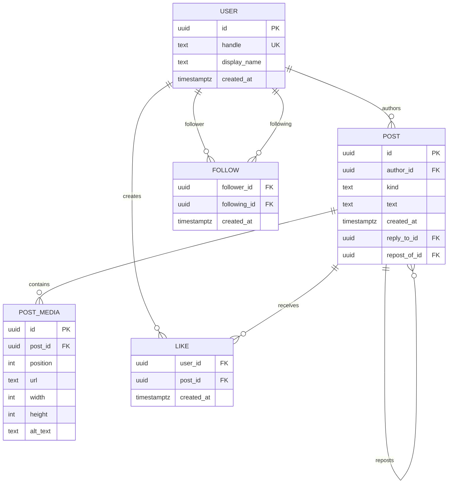

# PRD 03 — Conceptual Data Model

## Entities

The database uses five core entities required by PRD 03:

- User
- Post
- PostMedia
- Like
- Follow

## ERD

## Relationships

### User → Post

One user can author zero or many posts.

Each post has exactly one author.

**Cardinality:** `1:M`

### Post → PostMedia

An original post can contain zero or more media rows.

Media positions are ordered and the product allows a maximum of four images.

**Cardinality:** `1:M`

### User ↔ Post through Like

A user can like many posts, and a post can be liked by many users.

The `likes` table represents this many-to-many relationship.

**Cardinality:** `M:M`

### User ↔ User through Follow

A user can follow many users and can be followed by many users.

The relationship is directional:

`follower_id → following_id`

**Cardinality:** `M:M`

### Post → Post for replies

A reply is represented as a post that references its original post through `reply_to_id`.

The reply does not duplicate the original post's content.

### Post → Post for reposts

A repost is represented as a post that references its original post through `repost_of_id`.

A repost does not store duplicated original content.

## Post kinds

A post has one of three logical kinds:

- `original`
- `reply`
- `repost`

An original has no reply or repost target.

A reply references an original through `reply_to_id`.

A repost references an original through `repost_of_id`.

## Identifier and timestamp policy

Public entity identifiers use UUIDs.

Timestamps use PostgreSQL `timestamptz(3)` with a deliberate millisecond-precision policy.

## Design rationale

The model keeps users, posts, media, likes and follows normalized instead of embedding related collections inside a post or user record.

Likes and follows are relationship rows rather than counters or arrays.

Replies and reposts reference existing posts rather than copying the original content.

This allows relationships and integrity rules to be enforced by relational keys and constraints.